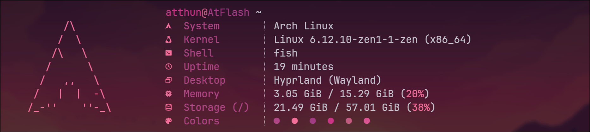

    
    <!--  -->
    

<h1 align="center">Microfetch</h1>

The Arch Linux fork of the "Stupidly simple, laughably fast fetch tool. Written in Rust for speed and ease of maintainability."

Don't mind the thousand commits for the README.md (im bad at md)

  

# Installation

> [!NOTE]
> You need a Nerd Font installed, and your terminal emulator must support it. Microfetch uses Nerd Font glyphs by default.

You can install microfetch for Arch Linux from the AUR or compile it from source using `cargo build --release`

## AUR
`paru -S microfetch`
or
`yay -S microfetch`

Thanks to [@NotAShelf](https://github.com/NotAShelf) for the original project [microfetch](https://github.com/NotAShelf/microfetch) 

